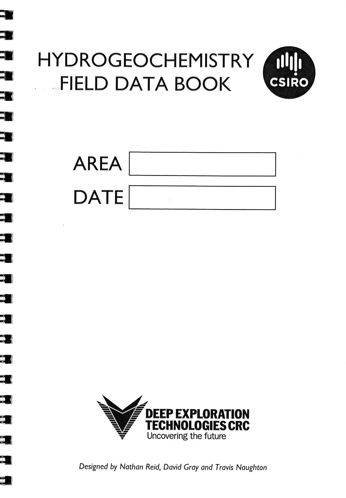

# Instructions 

Authors are kindly asked to prepare one presentation file fulfilling both needs, the introductory 2-minutes-madness as well as the following intensive viewing and discussions. Please include the summary of your work in the first two slides followed by an unlimited number of slides going more into detail. The touch screens have a size of 42". The operating system is Windows 7 and they have internet access. Although the screens are in the 16:9 widescreen format, we recommend producing Power Point or PDF presentations in the classic 4:3 format. The extra space is used for the branding of the contribution as well as the navigation. The touch screens show three buttons allowing you to move forwards and backwards in the presentation as well as to access the table of contents (PICO programme) of that particular session. Please note that Prezi is not supported.

PICO is short, precise, and scientific. PICO is bringing the advantages of both, oral and poster, together into an innovative type of presentation which opens the opportunity to be interactive. Every PICO author presents first his/her work orally. But afterwards, all session attendees have enough time to watch the presentation again, to hold discussions with the author and colleagues, and to network.

A PICO presentation might be a Power Point one, a movie, an animation, or simply a PDF showing your research on a display. A PICO session takes place at the PICO spot which is a combination of an audience sitting in front of a screen together with a number of touch screen displays (PICO screens). The PICO session starts with a 2-minutes-madness, where all authors present the essence of their work in 2 minutes each. Thereby, time is reserved for one PICO presentation to provide a 10-minutes-introduction. Afterwards, the audience is using the PICO screens spread in the PICO spot to view again their PICO presentation(s) of interest. Authors are standing next to their scheduled screen to show their PICO presentation. A PICO presentation should be composed in a way to fulfil both requirements in one file, the 2 minute overview as well as the extensive viewing afterwards. To give you an idea how your PICO could look like please see the examples from the past conferences below:

# Abstract

Multiple people creating data in the field poses a hard technical problem: our “web 2.0” environment presumes constant connectivity, data “authority” held by centralised servers, and sees mobile devices as tools for presentation rather than tools for origination. A particular design challenge is the remoteness of the sampling locations, hundreds of kilometres away from network access. The alternative, however, is hand collection with a lengthy, error prone, and expensive digitisation process. 

This poster will present a field-tested[^footnote1] open-source solution to field data recording. This solution, originally created by a community of archaeologists, needed to accommodate diverse recording methodologies. The community could not agree on standard vocabularies, workflows, attributes, or methodologies, but most agreed that “recording data in the field’’ was a desireable app to have. As a result, the app is generalised for field data collection; not only can it record a range of data types, but it is deeply customisable. 

The NeCTAR funded FAIMS Project, therefore, created an app which allows for arbitrary data collection in the field[^footnote2]. In order to accomplish this ambitious goal, FAIMS relied heavily on OSS projects including: spatialite and gdal (for GIS support), sqlite (for a lightweight key-attribute-value datastore), Javarosa and Beanshell (for UI and scripting), and the entire linux stack plus ruby for a server. 

Only by standing on the shoulders of giants, FAIMS was able to make a flexible and highly generalisable field data collection system that CSIRO geoscientists were able to customise to suit most of their completely unanticipated needs[^footnote3]. While single-task apps (i.e. those commissioned by structural geologists to take strikes and dips) will excel in their domains, other geoscientists (palaeoecologists, palaeontologists, anyone taking samples), likely cannot afford to commission domain- and methodology- specific recording tools for their custom recording needs. FAIMS shows the utility of OSS software development and provides geoscientists a way forward for edge-case field data collection. Moreover, as the data is completely open and exports are scriptable, federation with other data formats is both encouraged and possible. 

This poster will describe the internal architecture of the FAIMS app, show how it was used by CSIRO in the field, and display a graph of its OSS heritage. The app is available from Google Play, the recording module can be found at https://github.com/FAIMS/CSIRO-Water-Samples and the exporter we used can be found at https://github.com/FAIMS/shapefileExport. You can make your own data-collection modules for free via the user to developer documentation at https://www.fedarch.org/support/2.

# Title Slide

Intent of slide: captioned visual narrative. This slide can be used to describe the complete workflow of module history, generation, and use

Grid of pictures: 
* 
* 
* 

Paper notes: 

# Detail Slide

Intent of slide: Faims internal architecture, OSS Heritage graph

# Supplimentary Slides

## CSIRO Workflow

## Module Details

## Faims internal architecture

## OSS Heritage graph
